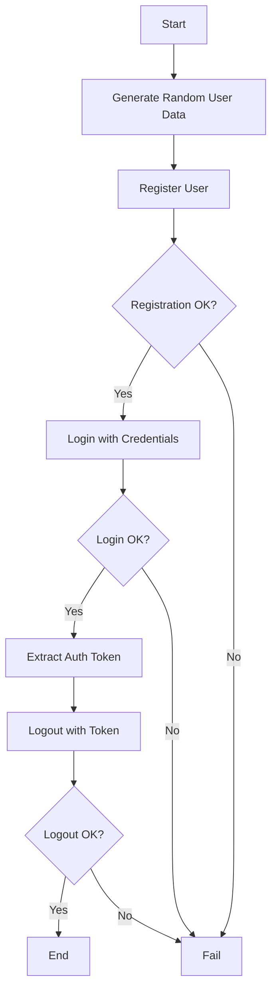

# Authentication Flow Example

## Overview
This example demonstrates a complete authentication flow including user registration, login, and logout operations using the k6 Enterprise Framework.

## What It Tests
- **User Registration**: Creates a new user account with random credentials
- **Login**: Authenticates the user and retrieves an auth token
- **Logout**: Properly terminates the user session

## Features Demonstrated
- ✅ Service object pattern (`AuthService`)
- ✅ Random data generation (`DataHelper`)
- ✅ Response validation (`ValidationHelper`)
- ✅ Token-based authentication
- ✅ Proper cleanup and session management

## Configuration

### Default Settings
```json
{
  "scenarios": {
    "default": {
      "executor": "constant-vus",
      "vus": 1,
      "duration": "30s"
    }
  },
  "thresholds": {
    "http_req_duration": ["p(95)<2000"],
    "checks": ["rate>0.9"]
  }
}
```

### Custom Configuration
You can override these settings by modifying `clients/examples/config/default.json` or creating environment-specific configs.

## Usage

### Run the Test
```bash
# Using the test runner script
./bin/testing/run-test.sh --client=examples --test=auth-flow.ts

# Using the CLI directly
node dist/core/cli.js --client=examples --test=auth-flow.ts

# With specific environment
./bin/testing/run-test.sh --client=examples --env=staging --test=auth-flow.ts
```

### Expected Output
```
✓ user registered successfully
✓ registration returns 201
✓ login successful
✓ login returns auth token
✓ logout successful
✓ logout returns 204

checks.........................: 100.00% ✓ 180 ✗ 0
http_req_duration..............: avg=245ms min=120ms med=230ms max=450ms p(90)=380ms p(95)=420ms
iterations.....................: 30
```

## Test Flow



## Code Structure

```typescript
// 1. Setup
const authService = new AuthService(config.baseUrl);

// 2. Generate test data
const username = `user_${DataHelper.randomString(8)}`;
const email = DataHelper.randomEmail();
const password = DataHelper.randomPassword();

// 3. Execute flow
const registerRes = authService.register(username, email, password);
const loginRes = authService.login(username, password);
const token = JSON.parse(loginRes.body).auth_token;
authService.logout(token);

// 4. Validate
check(registerRes, {
  'user registered successfully': (r) => ValidationHelper.hasStatus(r, 201)
});
```

## Validation Checks

| Check | Description | Expected |
|-------|-------------|----------|
| `user registered successfully` | Registration status code | 201 |
| `registration returns user id` | Response contains user ID | true |
| `login successful` | Login status code | 200 |
| `login returns auth token` | Response contains token | true |
| `logout successful` | Logout status code | 204 |

## Metrics Collected

- **HTTP Request Duration**: Time taken for each API call
- **HTTP Request Failed**: Rate of failed requests
- **Checks**: Validation pass rate
- **Iterations**: Number of complete flows executed

## Troubleshooting

### Common Issues

**Issue**: Registration fails with 409 Conflict
```
Solution: User already exists. The test uses random usernames to avoid this.
```

**Issue**: Login fails with 401 Unauthorized
```
Solution: Check that registration was successful and credentials are correct.
```

**Issue**: Logout fails with 401 Unauthorized
```
Solution: Ensure the auth token was properly extracted from login response.
```

## Related Examples

- [Mixed Test](../mixed-test/) - Combines API and browser testing
- [E-commerce Flow](../ecommerce-flow/) - Multi-step user journey
- [Example Test](../example/) - Basic service object usage

## Learn More

- [Service Objects Pattern](../../../docs/ARCHITECTURE.md#service-objects)
- [Data Helpers](../../../docs/HELPERS.md#datahelper)
- [Validation Helpers](../../../docs/HELPERS.md#validationhelper)
