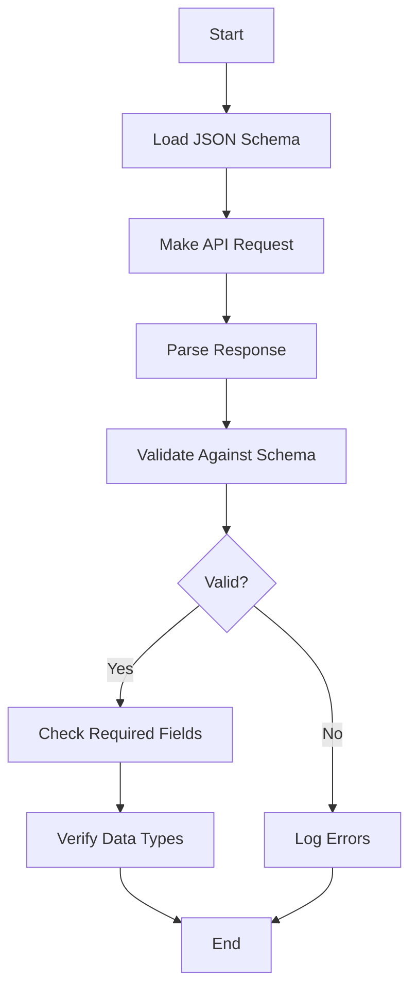

# Contract Testing Example

## Overview
This example demonstrates API contract testing using JSON Schema validation to ensure API responses comply with predefined contracts.

## What It Tests
- **Schema Validation**: Validates API responses against JSON schemas
- **Contract Compliance**: Ensures API adheres to documented contracts
- **Data Type Verification**: Checks correct data types and formats
- **Required Fields**: Validates presence of mandatory fields

## Features Demonstrated
- ✅ JSON Schema validation
- ✅ Contract validator helper
- ✅ Error reporting for violations
- ✅ Response parsing and validation
- ✅ Integration with external APIs

## Configuration

### Test Settings
```json
{
  "vus": 1,
  "duration": "10s"
}
```

### Schema Definition
Located at: `clients/examples/contracts/user-api.schema.json`

```json
{
  "$schema": "http://json-schema.org/draft-07/schema#",
  "type": "object",
  "required": ["id", "email", "name", "username"],
  "properties": {
    "id": {
      "type": "number",
      "minimum": 1
    },
    "email": {
      "type": "string",
      "format": "email"
    },
    "name": {
      "type": "string",
      "minLength": 1
    },
    "username": {
      "type": "string",
      "minLength": 1
    }
  }
}
```

## Usage

### Run the Test
```bash
# Using the test runner script
./bin/testing/run-test.sh --client=examples --test=contract-testing.ts

# With debug output
K6_DEBUG=true ./bin/testing/run-test.sh --client=examples --test=contract-testing.ts
```

### Expected Output
```
✓ response matches contract
✓ no validation errors
✓ status is 200
✓ response has id
✓ response has email
✓ response has name
✓ response has username

checks.........................: 100.00% ✓ 1155 ✗ 0
http_req_duration..............: avg=60ms min=54ms med=59ms max=96ms
iterations.....................: 165
```

## Test Flow



## Code Structure

```typescript
// 1. Load contract schema
const userSchema = JSON.parse(open('../contracts/user-api.schema.json'));

// 2. Make API request
const res = request.get('/users/1');

// 3. Parse response
const userData = JSON.parse(res.body as string);

// 4. Validate against contract
const validation = ContractValidator.validateSchema(userData, userSchema);

// 5. Check validation results
check(validation, {
  'response matches contract': (v) => v.valid,
  'no validation errors': (v) => v.errors.length === 0
});

// 6. Log errors if any
if (!validation.valid) {
  console.error('Contract validation failed:');
  validation.errors.forEach(err => console.error(`  - ${err}`));
}
```

## Validation Checks

| Check | Description | Expected |
|-------|-------------|----------|
| `response matches contract` | Schema validation passes | true |
| `no validation errors` | No schema violations | true |
| `status is 200` | HTTP status code | 200 |
| `response has id` | ID field present | true |
| `response has email` | Email field present | true |
| `response has name` | Name field present | true |
| `response has username` | Username field present | true |

## Contract Validation

### What Gets Validated

1. **Data Types**: Ensures fields have correct types (string, number, boolean, etc.)
2. **Required Fields**: Checks all mandatory fields are present
3. **Format Validation**: Validates formats like email, URI, date-time
4. **Value Constraints**: Checks min/max values, string lengths, patterns
5. **Nested Objects**: Validates complex nested structures

### Example Validation Errors

```
Contract validation failed:
  - id: Expected type 'number', got 'string'
  - email: Invalid email format
  - name: Missing required property 'name'
  - age: Value 200 exceeds maximum 150
```

## Creating Custom Schemas

### Basic Schema
```json
{
  "$schema": "http://json-schema.org/draft-07/schema#",
  "type": "object",
  "required": ["id", "name"],
  "properties": {
    "id": { "type": "number" },
    "name": { "type": "string" }
  }
}
```

### Advanced Schema with Validation
```json
{
  "$schema": "http://json-schema.org/draft-07/schema#",
  "type": "object",
  "required": ["email", "age"],
  "properties": {
    "email": {
      "type": "string",
      "format": "email"
    },
    "age": {
      "type": "integer",
      "minimum": 0,
      "maximum": 150
    },
    "role": {
      "type": "string",
      "enum": ["admin", "user", "guest"]
    },
    "tags": {
      "type": "array",
      "items": { "type": "string" },
      "minItems": 1
    }
  }
}
```

## Best Practices

1. **Version Your Schemas**: Keep schemas in version control
2. **Document Changes**: Update schemas when API changes
3. **Test Both Sides**: Validate requests and responses
4. **Use Strict Validation**: Set `additionalProperties: false` to catch unexpected fields
5. **Validate Early**: Run contract tests in CI/CD pipeline
6. **Share Schemas**: Use same schemas for API documentation

## Troubleshooting

### Common Issues

**Issue**: Schema validation fails with "Expected type 'integer', got 'number'"
```
Solution: JSON Schema draft-07 treats all numbers as 'number'. Use 'number' type instead of 'integer'.
```

**Issue**: Email format validation fails
```
Solution: Ensure the email string matches RFC 5322 format. Check for typos.
```

**Issue**: Schema file not found
```
Solution: Verify the schema file exists in clients/examples/contracts/ and the path is correct.
```

**Issue**: All checks fail with 404
```
Solution: Check the API endpoint URL. For jsonplaceholder, use /users/1 not /api/users/1.
```

## OpenAPI Integration

You can also validate against OpenAPI/Swagger schemas:

```typescript
import { ContractValidator } from '../../../shared/helpers/ContractValidator.js';

const openApiSpec = JSON.parse(open('../contracts/api-spec.json'));
const validation = ContractValidator.validateOpenAPI(res, openApiSpec, '/users/{id}', 'get');
```

## Related Examples

- [GraphQL Testing](../graphql-testing/) - GraphQL schema validation
- [Example Test](../example/) - Basic API testing
- [E-commerce Flow](../ecommerce-flow/) - Multi-step validation

## Learn More

- [JSON Schema Documentation](https://json-schema.org/)
- [Contract Testing Guide](../../../docs/CONTRACT_TESTING.md)
- [ContractValidator Helper](../../../docs/HELPERS.md#contractvalidator)
- [OpenAPI Specification](https://swagger.io/specification/)
