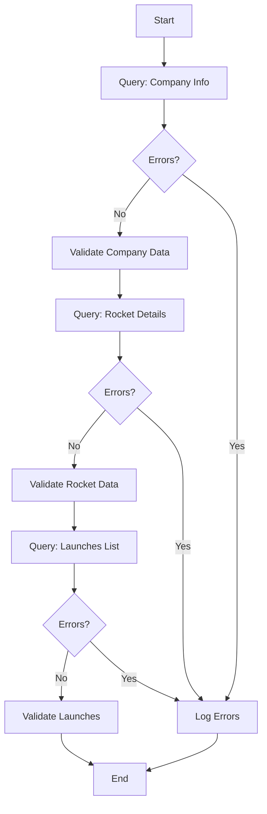

# GraphQL Testing Example

## Overview
This example demonstrates comprehensive GraphQL API testing including queries, variables, error handling, and response validation.

## What It Tests
- **GraphQL Queries**: Execute queries with and without variables
- **Error Detection**: Identify and report GraphQL errors
- **Response Parsing**: Extract and validate data from responses
- **Pagination**: Test paginated queries
- **Variable Handling**: Pass variables to parameterized queries

## Features Demonstrated
- ✅ GraphQL query execution
- ✅ Query variables and parameters
- ✅ Error detection and reporting
- ✅ Response data validation
- ✅ Integration with GraphQLHelper
- ✅ Real-world API testing (SpaceX API)

## Configuration

### Test Settings
```json
{
  "vus": 1,
  "duration": "30s"
}
```

### API Endpoint
Uses the public SpaceX GraphQL API: `https://spacex-production.up.railway.app`

## Usage

### Run the Test
```bash
# Using the test runner script
./bin/testing/run-test.sh --client=examples --test=graphql-testing.ts

# With debug output
K6_DEBUG=true ./bin/testing/run-test.sh --client=examples --test=graphql-testing.ts
```

### Expected Output
```
✓ company query has no errors
✓ company data exists
✓ company has name
✓ rocket query has no errors
✓ rocket data exists
✓ rocket is Falcon 9
✓ launches query has no errors
✓ launches data exists
✓ launches array has items

Retrieved 5 launches

checks.........................: 100.00% ✓ 270 ✗ 0
http_req_duration..............: avg=350ms min=200ms med=320ms max=650ms
iterations.....................: 30
```

## Test Flow



## Query Examples

### 1. Company Information Query

```graphql
query GetCompanyInfo {
  company {
    name
    founder
    founded
    employees
    ceo
    cto
    coo
    summary
  }
}
```

**Validation**:
```typescript
check(companyData, {
  'company query has no errors': (data) => !GraphQLHelper.hasErrors(data),
  'company data exists': (data) => !!data.data,
  'company has name': (data) => !!data.data?.company?.name
});
```

### 2. Rocket Query with Variables

```graphql
query GetRocket($id: ID!) {
  rocket(id: $id) {
    id
    name
    type
    active
    stages
    boosters
    cost_per_launch
    success_rate_pct
    first_flight
    country
    company
    description
  }
}
```

**Variables**:
```json
{
  "id": "falcon9"
}
```

**Usage**:
```typescript
const rocketRes = graphql.query(rocketQuery, { id: 'falcon9' });
const rocketData = GraphQLHelper.parseResponse(rocketRes);

check(rocketData, {
  'rocket query has no errors': (data) => !GraphQLHelper.hasErrors(data),
  'rocket is Falcon 9': (data) => data.data?.rocket?.name === 'Falcon 9'
});
```

### 3. Paginated Launches Query

```graphql
query GetLaunches($limit: Int!) {
  launches(limit: $limit) {
    id
    mission_name
    launch_date_utc
    launch_success
    rocket {
      rocket_name
    }
  }
}
```

**Variables**:
```json
{
  "limit": 5
}
```

## Code Structure

```typescript
// 1. Initialize GraphQL helper
const graphql = new GraphQLHelper('https://spacex-production.up.railway.app');

// 2. Define query
const query = `
  query GetCompanyInfo {
    company {
      name
      founder
    }
  }
`;

// 3. Execute query
const res = graphql.query(query);

// 4. Parse response
const data = GraphQLHelper.parseResponse(res);

// 5. Check for errors
if (GraphQLHelper.hasErrors(data)) {
  console.error('GraphQL Errors:', GraphQLHelper.getErrorMessages(data));
}

// 6. Validate data
check(data, {
  'query has no errors': (d) => !GraphQLHelper.hasErrors(d),
  'data exists': (d) => !!d.data
});
```

## Error Handling

### Detecting Errors

```typescript
if (GraphQLHelper.hasErrors(data)) {
  const errors = GraphQLHelper.getErrorMessages(data);
  console.error('GraphQL Errors:', errors);
}
```

### Common GraphQL Errors

1. **Syntax Errors**: Invalid query syntax
```json
{
  "errors": [{
    "message": "Syntax Error: Expected Name, found }",
    "locations": [{"line": 2, "column": 3}]
  }]
}
```

2. **Validation Errors**: Invalid field or type
```json
{
  "errors": [{
    "message": "Cannot query field 'invalidField' on type 'Company'"
  }]
}
```

3. **Execution Errors**: Runtime errors
```json
{
  "errors": [{
    "message": "Variable '$id' of required type 'ID!' was not provided"
  }]
}
```

## Advanced Features

### Mutations

```typescript
const mutation = `
  mutation CreateLaunch($input: LaunchInput!) {
    createLaunch(input: $input) {
      id
      mission_name
    }
  }
`;

const variables = {
  input: {
    mission_name: "Test Mission",
    rocket_id: "falcon9"
  }
};

const res = graphql.mutation(mutation, variables);
```

### Fragments

```typescript
const query = `
  fragment RocketInfo on Rocket {
    id
    name
    type
    active
  }

  query GetRockets {
    rockets {
      ...RocketInfo
    }
  }
`;
```

### Aliases

```typescript
const query = `
  query GetMultipleRockets {
    falcon9: rocket(id: "falcon9") {
      name
    }
    falconHeavy: rocket(id: "falconheavy") {
      name
    }
  }
`;
```

## Validation Checks

| Check | Description | Expected |
|-------|-------------|----------|
| `company query has no errors` | No GraphQL errors | true |
| `company data exists` | Response has data field | true |
| `company has name` | Company name present | true |
| `rocket query has no errors` | No GraphQL errors | true |
| `rocket data exists` | Response has data field | true |
| `rocket is Falcon 9` | Correct rocket returned | true |
| `launches query has no errors` | No GraphQL errors | true |
| `launches data exists` | Response has data field | true |
| `launches array has items` | Array not empty | true |

## Best Practices

1. **Use Fragments**: Reuse common field selections
2. **Handle Errors**: Always check for GraphQL errors
3. **Validate Types**: Ensure correct data types in responses
4. **Use Variables**: Parameterize queries for flexibility
5. **Limit Data**: Request only needed fields
6. **Add Aliases**: Query same field with different arguments
7. **Test Pagination**: Verify limit and offset work correctly

## Troubleshooting

### Common Issues

**Issue**: Query returns errors about unknown fields
```
Solution: Check the GraphQL schema. The field might not exist or have a different name.
Use introspection to explore available fields.
```

**Issue**: Variables not being passed correctly
```
Solution: Ensure variable types match the schema definition. Use ! for required variables.
```

**Issue**: Response data is null
```
Solution: Check for errors in the response. The query might be syntactically correct but
logically invalid (e.g., querying non-existent ID).
```

**Issue**: Timeout errors
```
Solution: GraphQL queries can be complex. Reduce the amount of data requested or
increase the timeout threshold.
```

## Schema Introspection

Query the schema to explore available types and fields:

```typescript
const introspectionQuery = `
  query IntrospectionQuery {
    __schema {
      types {
        name
        kind
        fields {
          name
          type {
            name
          }
        }
      }
    }
  }
`;

const schema = graphql.query(introspectionQuery);
console.log(JSON.stringify(schema, null, 2));
```

## Related Examples

- [Contract Testing](../contract-testing/) - JSON Schema validation
- [Example Test](../example/) - Basic API testing
- [Rate Limiting](../rate-limiting/) - Handling rate limits

## Learn More

- [GraphQL Documentation](https://graphql.org/)
- [SpaceX API](https://github.com/r-spacex/SpaceX-API)
- [GraphQLHelper Documentation](../../../docs/HELPERS.md#graphqlhelper)
- [GraphQL Best Practices](https://graphql.org/learn/best-practices/)
