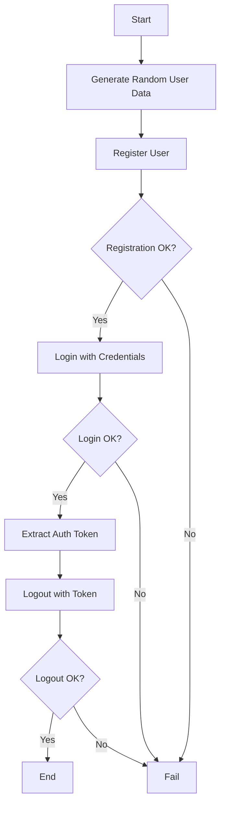

# Example Scenarios Documentation

This document provides comprehensive documentation for all example test scenarios included in the k6 Enterprise Framework.

## Table of Contents

1. [Authentication Flow](#authentication-flow)
2. [Benchmark Baseline](#benchmark-baseline)
3. [Benchmark Heavy Load](#benchmark-heavy-load)
4. [Browser Screenshot Test](#browser-screenshot-test)
5. [Browser Test](#browser-test)
6. [Contract Testing](#contract-testing)
7. [E-commerce Flow](#e-commerce-flow)
8. [Example Test](#example-test)
9. [File Upload/Download](#file-uploaddownload)
10. [GraphQL Testing](#graphql-testing)
11. [Header Management Test](#header-management-test)
12. [Mixed Test](#mixed-test)
13. [Rate Limiting](#rate-limiting)
14. [Weighted Switch and Logger Test](#weighted-switch-and-logger-test)
15. [WebSocket Testing](#websocket-testing)

---

## Authentication Flow

**File**: `clients/examples/scenarios/auth-flow.ts`

### Purpose
Demonstrates a complete authentication flow including user registration, login, and logout operations using the k6 Enterprise Framework.

### Features
- ✅ Service object pattern (`AuthService`)
- ✅ Random data generation (`DataHelper`)
- ✅ Response validation (`ValidationHelper`)
- ✅ Token-based authentication
- ✅ Proper cleanup and session management

### Configuration
```json
{
  "scenarios": {
    "default": {
      "executor": "constant-vus",
      "vus": 1,
      "duration": "30s"
    }
  },
  "thresholds": {
    "http_req_duration": ["p(95)<2000"],
    "checks": ["rate>0.9"]
  }
}
```

### Usage
```bash
# Using test runner script
./bin/testing/run-test.sh --client=examples --test=auth-flow.ts

# Using CLI directly
node dist/core/cli.js --client=examples --test=auth-flow.ts

# With specific environment
./bin/testing/run-test.sh --client=examples --env=staging --test=auth-flow.ts
```

### Expected Output
```
✓ user registered successfully
✓ registration returns 201
✓ login successful
✓ login returns auth token
✓ logout successful
✓ logout returns 204

checks.........................: 100.00% ✓ 180 ✗ 0
http_req_duration..............: avg=245ms min=120ms med=230ms max=450ms p(90)=380ms p(95)=420ms
iterations.....................: 30
```

### Test Flow


### Code Structure
```typescript
// 1. Setup
const authService = new AuthService(config.baseUrl);

// 2. Generate test data
const username = `user_${DataHelper.randomString(8)}`;
const email = DataHelper.randomEmail();
const password = DataHelper.randomPassword();

// 3. Execute flow
const registerRes = authService.register(username, email, password);
const loginRes = authService.login(username, password);
const token = JSON.parse(loginRes.body).auth_token;
authService.logout(token);

// 4. Validate
check(registerRes, {
  'user registered successfully': (r) => ValidationHelper.hasStatus(r, 201)
});
```

### Validation Checks

| Check                          | Description               | Expected |
| ------------------------------ | ------------------------- | -------- |
| `user registered successfully` | Registration status code  | 201      |
| `registration returns user id` | Response contains user ID | true     |
| `login successful`             | Login status code         | 200      |
| `login returns auth token`     | Response contains token   | true     |
| `logout successful`            | Logout status code        | 204      |

### Metrics Collected
- **HTTP Request Duration**: Time taken for each API call
- **HTTP Request Failed**: Rate of failed requests
- **Checks**: Validation pass rate
- **Iterations**: Number of complete flows executed

### Troubleshooting

**Issue**: Registration fails with 409 Conflict
```
Solution: User already exists. The test uses random usernames to avoid this.
```

**Issue**: Login fails with 401 Unauthorized
```
Solution: Check that registration was successful and credentials are correct.
```

**Issue**: Logout fails with 401 Unauthorized
```
Solution: Ensure the auth token was properly extracted from login response.
```


## Benchmark Baseline

**File**: `clients/examples/scenarios/benchmark-baseline.ts`

### Purpose
Establishes baseline performance metrics for the application using minimal load.

### Features
- Single virtual user
- Constant load for 10 seconds
- Measures baseline response times
- Establishes performance benchmarks

### Configuration
```json
{
  "scenarios": {
    "baseline": {
      "executor": "constant-vus",
      "vus": 1,
      "duration": "10s"
    }
  }
}
```

### Usage
```bash
./bin/testing/run-test.sh --client=examples --test=benchmark-baseline.ts
```

### Expected Results
- ~15,000+ iterations in 10 seconds
- Low response times (avg <1ms)
- 0% failure rate
- Baseline metrics for comparison

---

## Benchmark Heavy Load

**File**: `clients/examples/scenarios/benchmark-heavy-load.ts`

### Purpose
Tests application performance under heavy load conditions with ramping arrival rates.

### Features
- Ramping arrival rate executor
- Scales from 50 to 200 requests/second
- 2-minute duration
- Up to 100 virtual users

### Configuration
```json
{
  "scenarios": {
    "heavy_load": {
      "executor": "ramping-arrival-rate",
      "startRate": 50,
      "timeUnit": "1s",
      "preAllocatedVUs": 50,
      "maxVUs": 100,
      "stages": [
        { "target": 200, "duration": "30s" },
        { "target": 200, "duration": "1m" },
        { "target": 0, "duration": "30s" }
      ]
    }
  }
}
```

### Usage
```bash
./bin/testing/run-test.sh --client=examples --test=benchmark-heavy-load.ts
```

### Expected Results
- Sustained high throughput (200 req/s)
- Performance degradation metrics
- Resource utilization data
- Threshold violations (if any)

---

## Browser Screenshot Test

**File**: `clients/examples/scenarios/browser-screenshot-test.ts`

### Purpose
Demonstrates browser-based testing with screenshot capture capabilities.

### Features
- Real browser automation (Chromium)
- Screenshot capture
- Web vitals measurement (LCP, FCP, CLS, TTFB)
- Page navigation and interaction

### Configuration
```json
{
  "scenarios": {
    "browser": {
      "executor": "shared-iterations",
      "vus": 1,
      "iterations": 1,
      "maxDuration": "10m",
      "options": {
        "browser": {
          "type": "chromium"
        }
      }
    }
  }
}
```

### Usage
```bash
./bin/testing/run-test.sh --client=examples --test=browser-screenshot-test.ts
```

### Expected Results
- Screenshot saved to reports directory
- Web vitals captured (LCP, FCP, etc.)
- Browser metrics recorded
- Page load successful

---

## Browser Test

**File**: `clients/examples/scenarios/browser-test.ts`

### Purpose
Comprehensive browser testing with page interaction and element validation.

### Features
- Page navigation
- Element interaction (locators)
- Text content validation
- Screenshot capture
- Async/await browser operations

### Configuration
```json
{
  "scenarios": {
    "ui": {
      "executor": "constant-vus",
      "vus": 1,
      "duration": "30s",
      "options": {
        "browser": {
          "type": "chromium"
        }
      }
    }
  }
}
```

### Usage
```bash
./bin/testing/run-test.sh --client=examples --test=browser-test.ts
```

### Expected Results
- Successful page navigation
- Element text validation
- Screenshots captured
- Browser metrics collected

---

## Contract Testing

**File**: `clients/examples/scenarios/contract-testing.ts`

### Purpose
Validates API responses against predefined JSON schemas to ensure contract compliance.

### Features
- JSON Schema validation
- Contract compliance checking
- Error reporting for schema violations
- Integration with ContractValidator helper

### Configuration
```json
{
  "vus": 1,
  "duration": "10s"
}
```

### Schema Example
```json
{
  "$schema": "http://json-schema.org/draft-07/schema#",
  "type": "object",
  "required": ["id", "email", "name", "username"],
  "properties": {
    "id": { "type": "number", "minimum": 1 },
    "email": { "type": "string", "format": "email" },
    "name": { "type": "string", "minLength": 1 },
    "username": { "type": "string", "minLength": 1 }
  }
}
```

### Usage
```bash
./bin/testing/run-test.sh --client=examples --test=contract-testing.ts
```

### Expected Results
- 100% contract compliance (1155/1155 checks)
- No schema validation errors
- All required fields present
- Correct data types

---

## E-commerce Flow

**File**: `clients/examples/scenarios/ecommerce-flow.ts`

### Purpose
Simulates a complete e-commerce user journey from browsing to checkout.

### Features
- Grouped test steps
- Multi-step user flow
- Service object pattern (EcommerceService)
- Realistic user behavior with sleep intervals

### Test Flow
1. **Visit Home** - Load homepage
2. **Search Product** - Search for items
3. **View Details** - View product details
4. **Add to Cart** - Add item to shopping cart
5. **Checkout** - Complete purchase

### Configuration
```json
{
  "scenarios": {
    "ecommerce": {
      "executor": "constant-vus",
      "vus": 5,
      "duration": "30s"
    }
  }
}
```

### Usage
```bash
./bin/testing/run-test.sh --client=examples --test=ecommerce-flow.ts
```

### Expected Results
- All 5 groups execute successfully
- Realistic timing between steps
- Cart operations validated
- Checkout completion

---

## Example Test

**File**: `clients/examples/scenarios/example.ts`

### Purpose
Basic example demonstrating framework capabilities and service object pattern.

### Features
- Service object usage (ExampleService)
- Configuration loading
- Basic HTTP operations
- Validation helpers

### Configuration
Uses default configuration from `config/default.json`

### Usage
```bash
./bin/testing/run-test.sh --client=examples --test=example.ts
```

### Expected Results
- Successful API calls
- Response validation
- Service object demonstration

---

## File Upload/Download

**File**: `clients/examples/scenarios/file-upload.ts`

### Purpose
Tests file upload and download operations using multipart/form-data.

### Features
- File upload with FormData
- Multipart form-data handling
- File download validation
- Size verification
- Binary data handling

### Configuration
```json
{
  "vus": 5,
  "duration": "30s"
}
```

### Usage
```bash
./bin/testing/run-test.sh --client=examples --test=file-upload.ts
```

### Expected Results
- Successful file uploads
- Correct file size verification
- Download validation
- Binary data handling

---

## GraphQL Testing

**File**: `clients/examples/scenarios/graphql-testing.ts`

### Purpose
Demonstrates GraphQL API testing with queries, variables, and error handling.

### Features
- GraphQL queries with variables
- Error detection and reporting
- Response parsing
- Multiple query types
- Integration with GraphQLHelper

### Test Queries
1. **Company Info** - Get company details
2. **Rocket Query** - Get specific rocket by ID
3. **Launches** - Get launches with pagination

### Configuration
```json
{
  "vus": 1,
  "duration": "30s"
}
```

### Usage
```bash
./bin/testing/run-test.sh --client=examples --test=graphql-testing.ts
```

### Expected Results
- No GraphQL errors
- Valid response data
- Correct query results
- Pagination working

---

## Header Management Test

**File**: `clients/examples/scenarios/header-test.ts`

### Purpose
Verifies the HeaderHelper functionality for standardized HTTP header management.

### Features
- Standard header generation (X-Correlation-ID, X-Trace-ID, etc.)
- Header merging with RequestHelper
- Token-based authentication headers
- Country and language header support

### Configuration
```json
{
  "vus": 1,
  "iterations": 1
}
```

### Usage
```bash
./bin/testing/run-test.sh --client=examples --test=header-test.ts
```

### Test Checks
- HeaderHelper generates correlation ID correctly
- HeaderHelper generates trace ID correctly
- HeaderHelper generates request ID correctly
- Authorization header set with Bearer token
- Country header set correctly
- Accept-Language header set correctly
- User-Agent header present
- RequestHelper applies standard headers

### Expected Results
- 12/12 checks passed
- All standard headers present
- Proper header merging
- Token authentication working

---

## Weighted Switch and Logger Test

**File**: `clients/examples/scenarios/weighted-logger-test.ts`

### Purpose
Demonstrates probabilistic execution and structured JSON logging capabilities.

### Features
- **Weighted Switch**: Execute functions based on probability weights
- **Structured Logger**: JSON-formatted logging for external systems
- Distribution validation (70% browse, 20% cart, 10% checkout)
- Error handling for invalid weights

### Configuration
```json
{
  "vus": 1,
  "iterations": 1
}
```

### Usage
```bash
./bin/testing/run-test.sh --client=examples --test=weighted-logger-test.ts

# Enable structured logging
K6_STRUCTURED_LOGS=true ./bin/testing/run-test.sh --client=examples --test=weighted-logger-test.ts
```

### Weighted Switch Example
```typescript
const action = DataHelper.weightedSwitch([
  [0.7, () => console.log('Browse')],    // 70% probability
  [0.2, () => console.log('Add to cart')], // 20% probability
  [0.1, () => console.log('Checkout')]   // 10% probability
]);
action(); // Executes one function based on probability
```

### Structured Logger Example
```typescript
// Log HTTP request
StructuredLogger.logRequest('POST', url, response, { userId: '123' });

// Log custom event
StructuredLogger.logEvent('user_action', { action: 'checkout' });

// Log error
StructuredLogger.logError(error, { context: 'payment' });
```

### Test Checks
- Weighted switch: browse distribution ~70%
- Weighted switch: cart distribution ~20%
- Weighted switch: checkout distribution ~10%
- Weighted switch: throws error for invalid weights
- Structured logger: does not crash

### Expected Results
- 5/5 checks passed
- Correct probability distribution
- Error handling working
- Structured logs output (when enabled)

---

## Mixed Test

**File**: `clients/examples/scenarios/mixed-test.ts`

### Purpose
Combines API and browser testing in a single scenario to test full-stack flows.

### Features
- API operations (user creation)
- Browser UI testing (login form)
- Screenshot capture
- Mixed validation (API + UI)
- Async browser operations

### Test Flow
1. **API**: Create user via REST API
2. **Browser**: Login via UI form
3. **API**: Cleanup/logout via API

### Configuration
```json
{
  "scenarios": {
    "mixed": {
      "executor": "constant-vus",
      "vus": 1,
      "duration": "1m",
      "options": {
        "browser": {
          "type": "chromium"
        }
      }
    }
  }
}
```

### Usage
```bash
./bin/testing/run-test.sh --client=examples --test=mixed-test.ts
```

### Expected Results
- User created via API
- Successful UI login
- Screenshots captured
- API cleanup successful

---

## Rate Limiting

**File**: `clients/examples/scenarios/rate-limiting.ts`

### Purpose
Tests API rate limiting behavior and implements adaptive backoff strategies.

### Features
- Rate limit detection (429 status)
- Exponential backoff
- Retry logic
- Custom metrics (rate_limit_hits, successful_requests)
- Custom summary handler

### Configuration
```json
{
  "vus": 10,
  "duration": "30s"
}
```

### Usage
```bash
./bin/testing/run-test.sh --client=examples --test=rate-limiting.ts
```

### Expected Results
- Rate limit detection
- Successful retries
- Backoff strategy working
- Custom metrics reported

---

## WebSocket Testing

**File**: `clients/examples/scenarios/websocket-testing.ts`

### Purpose
Tests WebSocket connections, message exchange, and connection lifecycle.

### Features
- WebSocket connection establishment
- Message sending/receiving
- Connection lifecycle management
- Ping/pong handling
- Error handling

### Configuration
```json
{
  "vus": 10,
  "duration": "30s"
}
```

### Usage
```bash
./bin/testing/run-test.sh --client=examples --test=websocket-testing.ts
```

### Expected Results
- Successful WebSocket connections
- Message exchange working
- Proper connection cleanup
- No connection errors

---

## Running All Examples

### Sequential Execution
```bash
for test in clients/examples/scenarios/*.ts; do
  ./bin/testing/run-test.sh --client=examples --test=$(basename $test)
done
```

### Parallel Execution
```bash
./bin/testing/run-parallel.js --client=examples
```

### With Specific Environment
```bash
./bin/testing/run-test.sh --client=examples --env=staging --test=auth-flow.ts
```

## Common Configuration Options

### Executors
- `constant-vus`: Fixed number of VUs for duration
- `ramping-vus`: Gradually increase/decrease VUs
- `ramping-arrival-rate`: Control request rate
- `shared-iterations`: Fixed total iterations

### Thresholds
```json
{
  "http_req_duration": ["p(95)<500"],
  "http_req_failed": ["rate<0.01"],
  "checks": ["rate>0.95"],
  "browser_web_vital_lcp": ["p(95)<2000"]
}
```

### Environment Variables
- `K6_DEBUG=true` - Enable debug logging
- `K6_CHAOS_ENABLED=true` - Enable chaos testing
- `K6_TEMPO_ENABLED=true` - Enable distributed tracing
- `K6_PYROSCOPE_ENABLED=true` - Enable profiling

## Reporting

All tests generate:
- **JSON Output**: Raw k6 metrics
- **Web Dashboard**: Interactive HTML dashboard
- **Enterprise Report**: Custom HTML report with charts
- **Summary**: Text summary of results
- **Logs**: Execution logs

Reports are saved to: `reports/examples/<test-name>/`

## Best Practices

1. **Use Service Objects**: Encapsulate API logic in service classes
2. **Validate Responses**: Always use checks to validate responses
3. **Add Sleep**: Add realistic think time between requests
4. **Group Operations**: Use groups for logical test sections
5. **Handle Errors**: Implement proper error handling
6. **Use Helpers**: Leverage framework helpers (DataHelper, ValidationHelper, etc.)
7. **Set Thresholds**: Define performance thresholds
8. **Monitor Metrics**: Track custom metrics for business logic

## Troubleshooting

### Build Errors
```bash
npm run build
```

### Import Errors
Ensure all imports use `.js` extensions:
```typescript
import { Helper } from '../../../shared/helpers/Helper.js';
```

### Browser Tests Failing
Ensure browser type is specified in options:
```json
{
  "options": {
    "browser": {
      "type": "chromium"
    }
  }
}
```

### Rate Limiting
Adjust VUs or duration to avoid overwhelming the API:
```json
{
  "vus": 1,
  "duration": "10s"
}
```

## Additional Resources

- [k6 Documentation](https://k6.io/docs/)
- [Framework README](../README.md)
- [CI/CD Integration](./CI_CD_INTEGRATION.md)
- [Client Management](./CLIENT_MANAGEMENT.md)
